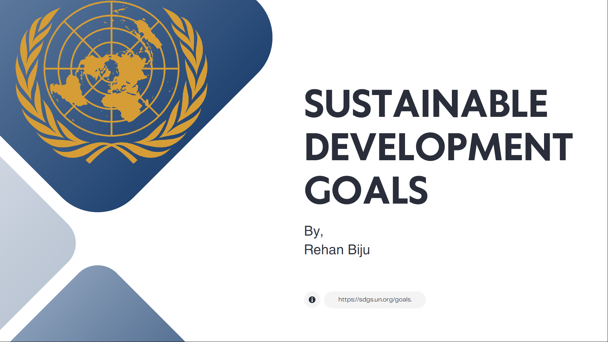

# Sustainable-Development-Report-Analysis

## Overview

This repository contains my presentation and analysis of the **United Nations Sustainable Development Goals (SDGs)** using the **Sustainable Development Report 2024**.

The project focuses on understanding global sustainable development by comparing country rankings, regional performance, and India's progress towards achieving the SDGs. It demonstrates statistical interpretation, comparative analysis, and effective presentation of real-world data.

This presentation was prepared as part of my **Bachelor of Science (B.Sc.) in Statistics**.

---

## Objectives

- Understand the United Nations Sustainable Development Goals (SDGs)
- Study the Sustainable Development Report 2024
- Analyze global SDG rankings
- Compare the performance of countries and regions
- Examine India's SDG progress
- Interpret sustainability indicators using statistical concepts

---

## Topics Covered

- Introduction to Sustainable Development Goals
- History of SDGs
- The 17 Global Goals
- Sustainable Development Report 2024
- Global Country Rankings
- Best Performing Countries
- Lowest Performing Countries
- Regional Analysis
- East & South Asia Performance
- India's SDG Performance
- Government Initiatives
- SDG India Index
- State-wise SDG Performance
- Key Findings
- References

---

## Skills Demonstrated

- Statistical Analysis
- Comparative Analysis
- Report Analysis
- Research Methodology
- Data Visualization
- Presentation Design
- Sustainable Development Research

---

## Repository Structure

```
Sustainable-Development-Goals-SDG-Report-Analysis-2024/
│
├── presentation/
│   └── Sustainable_Development_Goals_Analysis.pdf
│
├── images/
│   ├── cover.png
│   ├── global-ranking.png
│   └── india-analysis.png
│
├── references/
│   ├── Sustainable_Development_Report_2024.pdf
│   └── SDG_India_Index_2023_24.pdf
│
└── README.md
```

---

## Presentation Preview

<p align="center">
  
</p>


## References

- United Nations Sustainable Development Goals
- Sustainable Development Report 2024
- NITI Aayog SDG India Index 2023–24

---

##  Academic Information

**Degree:** Bachelor of Science (B.Sc.) in Statistics

**Project Type:** Academic Presentation & Report Analysis

**Domain:** Statistics | Sustainable Development | Data Analysis

